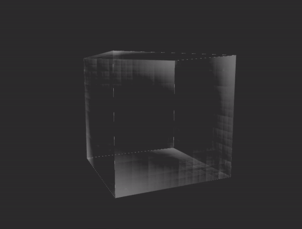

# ICECUBE

[Live Demo](https://cryszzz.github.io/hw00-intro-base)

Description:
I implemented the color controller and the cube as outlined in instrcution. 

For fragment shader, I implemented FBM and Perlin Noise with fade interpolation to give a looking of ice material on each surface of the icecube. 

For vertex shader, I originally implemented distorted polygon changes and rotation with some noise adding to the cube. However, it did not look really nice (I keep the code in comment). Therefore, I changed to some random rotation with sin and cos function in order to change the vertices of cubes. 