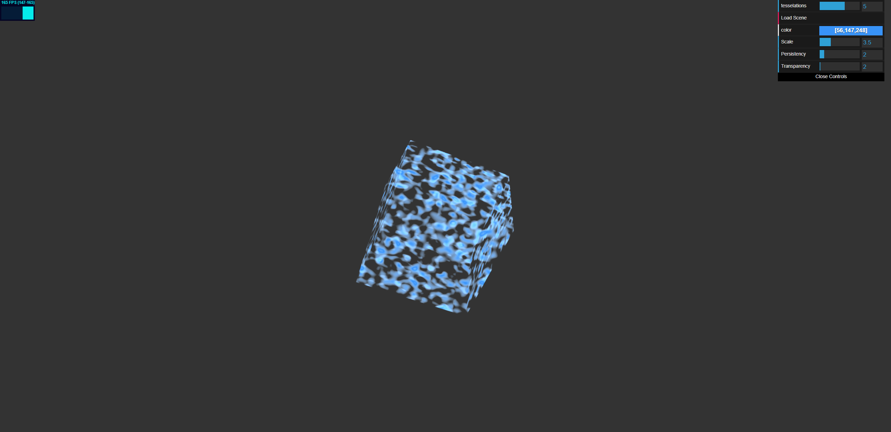

## Demo
[Live Demo](https://danielzhong.github.io/hw00-intro-base/)   

* I implemented Perlin Noise in a fragment shader, complemented by a sine function in the vertex shader for movement dynamics. The core components of the Perlin Noise algorithm include the "fade" function, which ensures a smooth transition between gradient vectors to avoid abrupt changes, and the "grad" function, which computes the dot product between the gradient vectors and their offsets, a pivotal step for deriving noise values. The "octave" represents different layers of noise characterized by varying frequencies and amplitudes. By layering these octaves and adjusting the alpha value for transparency based on the Perlin noise, I achieved wavy patterns that effectively simulate the appearance of a water surface, as demonstrated in my demo.

